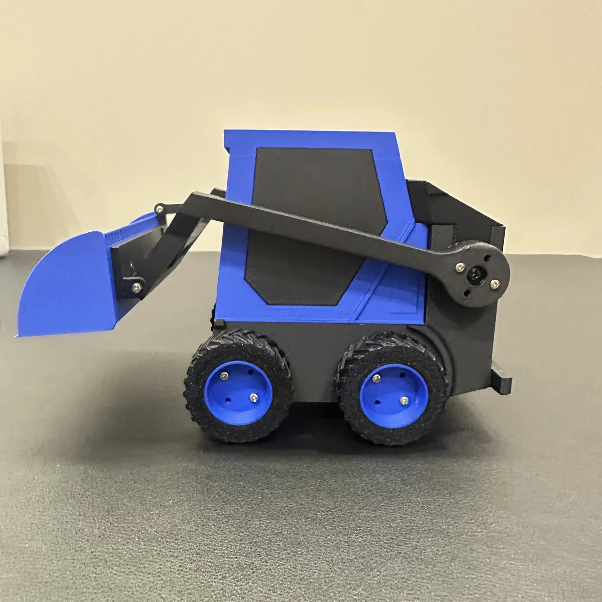
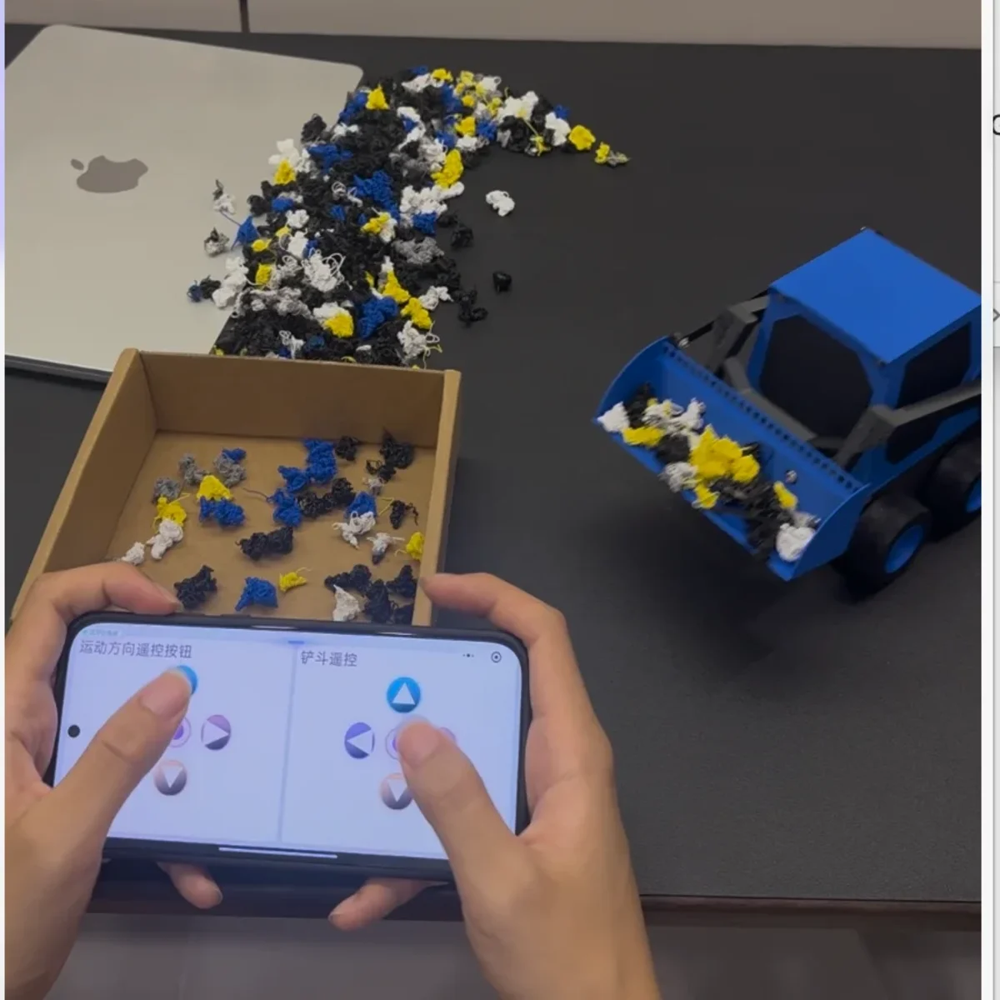
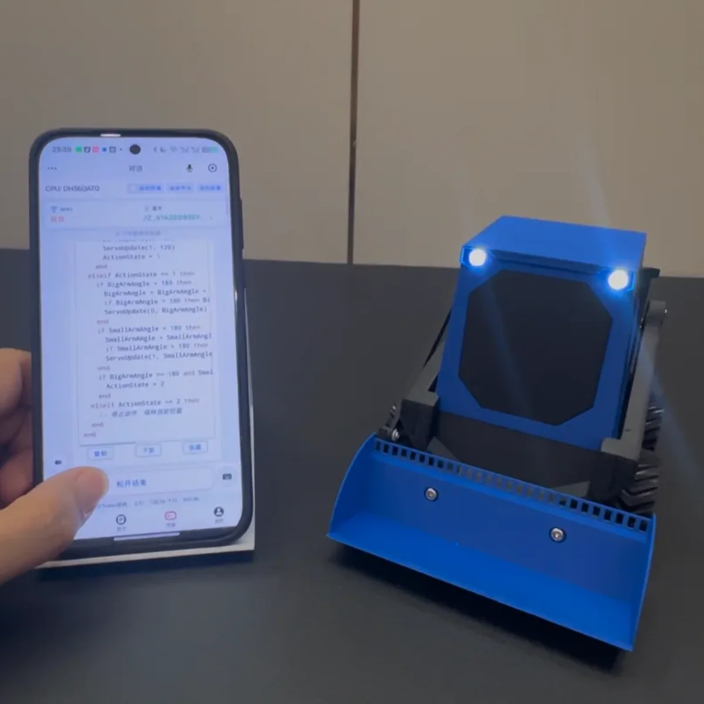
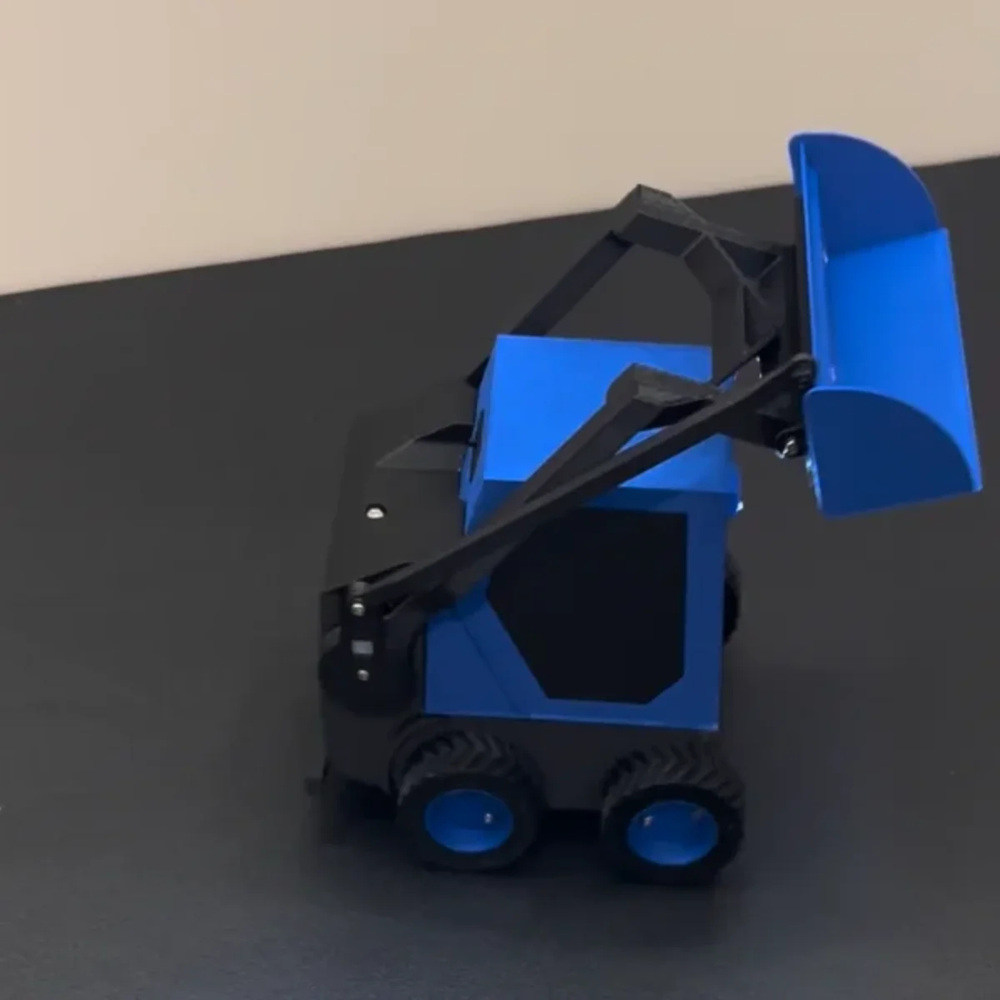

# 蓝色挖掘机 BlueDigger

[中文](README.md) | [English](README_EN.md)

<p align="center">
  
</p>

本作品使用了 FlexLua 的 CPU-302 AI 自编程控制单元，因此不需要编程即可让 302 实现想要的功能。3D 打印文件已开源，可用拓竹 3D 打印机打印。更多关于 FlexLua 介绍可访问 [flexlua.com](https://flexlua.com)。

---

## 项目一：手机遥控



### 项目介绍

通过手机蓝牙 App / 小程序上的「遥控按钮组合」小控件，遥控挖掘机动作（前后左右运动 + 铲斗翻动）。

**项目视频：** https://www.bilibili.com/video/BV1rQbL69Evz/

**需满足如下条件才能实现本项目：**

1. 准备好 CPU-302 及相关配件
2. App 上勾选「终端」，并在终端页面 Y0 区和 Y1 区域添加两个「遥控按钮组合」控件，用来控制挖掘机的前后左右运动、铲斗翻动动作

### 前置描述

```
我做了一辆挖掘机，M1接左侧轮电机，M0接右侧轮电机，前进时左右电机都需正转，后退时左右电机都需反转。左转时右侧电机正转左侧电机反转，转速都是满转速以此类推。P0接大臂舵机，P1接小臂舵机，V0接车灯，按一下点亮再按关闭。上电后大臂和小臂舵机初始位置都在最大角度180度。运动时大臂的舵机度数绝对不能低于120度。
```

### AI 词条 1

```
帮我实现手机遥控挖掘机的功能
```

---

## 项目二：车灯 + 轮子 + 前后运动控制



### 项目介绍

通过 3 个示例，演示如何让挖掘机自动闪灯、左右转轮胎、前后运动。

**项目视频：** https://www.bilibili.com/video/BV1kQbL69EPT/

**实现本项目需满足如下条件：**

1. 准备好 CPU-302 以及相关配件

### 前置描述

```
我做了一辆挖掘机，M1接左侧轮电机，M0接右侧轮电机，前进时左右电机都需正转，后退时左右电机都需反转。左转时右侧电机正转左侧电机反转，转速都是满转速以此类推。P0接大臂舵机，P1接小臂舵机，V0接车灯，按一下点亮再按关闭。上电后大臂和小臂舵机初始位置都在最大角度180度。运动时大臂的舵机度数绝对不能低于120度。
```

### AI 词条 1

```
车灯连续亮10次
```

### AI 词条 2

```
挖掘机的轮子左晃一下，右晃一下，这样来回晃动三次，然后停下来不动
```

### AI 词条 3

```
挖掘机前进3秒，然后后退3秒，这样往复循环两次
```

---

## 项目三：挖掘机跳舞



### 项目介绍

让挖掘机自己生成代码实现跳舞的效果。

**项目视频：** https://www.bilibili.com/video/BV1kQbL69EA1/

**实现本项目需满足如下条件：**

1. 准备好 CPU-302 以及相关配件

### 前置描述

```
我做了一辆挖掘机，M1接左侧轮电机，M0接右侧轮电机，前进时左右电机都需正转，后退时左右电机都需反转。左转时右侧电机正转左侧电机反转，转速都是满转速以此类推。P0接大臂舵机，P1接小臂舵机，V0接车灯，按一下点亮再按关闭。上电后大臂和小臂舵机初始位置都在最大角度180度。运动时大臂的舵机度数绝对不能低于120度。
```

### AI 词条 1

```
帮我实现一个代码，让挖掘机开始跳舞
```

---

## 技术交流联系

- 微信：stdlib-h
- Email：shineblink666@gmail.com
